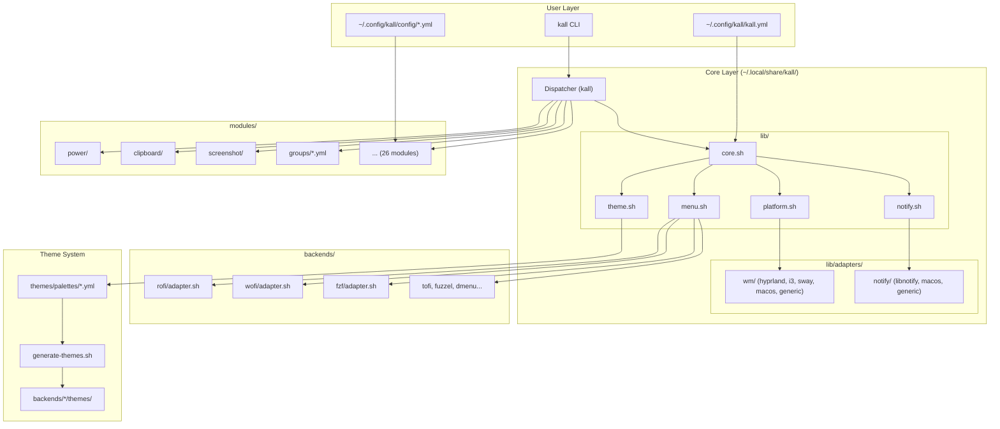
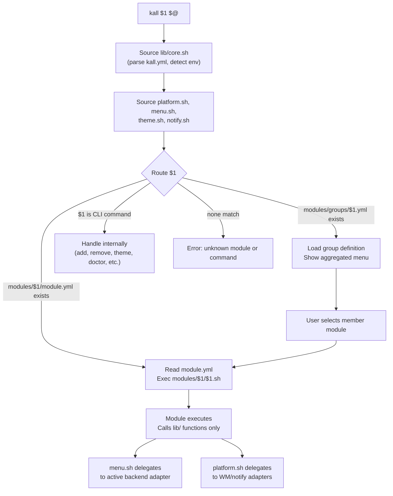
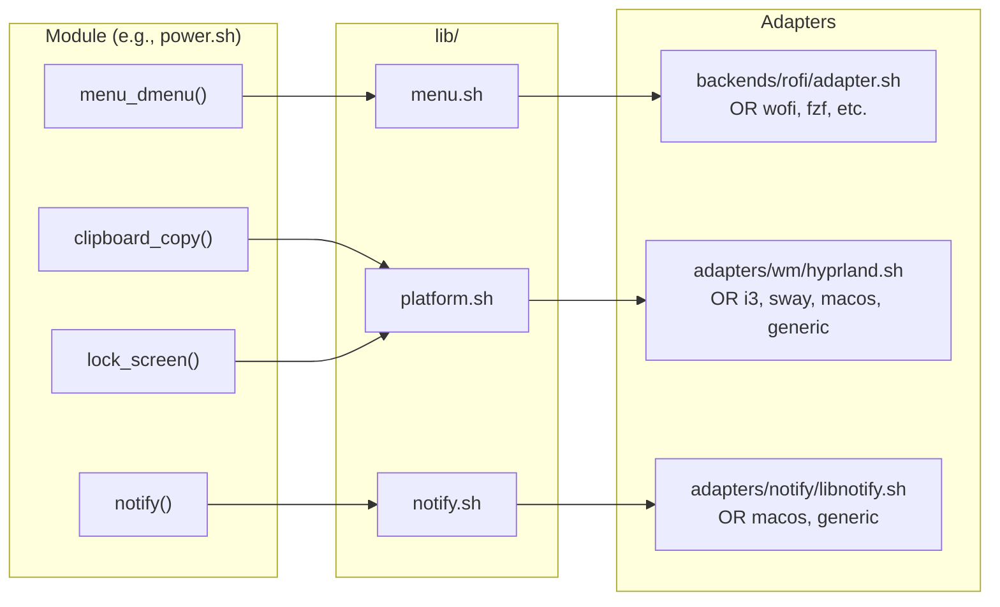

kall is structured as a layered system where each layer has a single responsibility and communicates through well-defined interfaces. This page covers the high-level architecture, the dispatcher routing model, and how adapters are resolved at runtime.

## Three-Layer Model

kall separates concerns into three layers:

- **User Layer** — configuration files and the CLI entry point. The user interacts with `kall.yml`, module configs, and the `kall` command.
- **Core Layer** — shared libraries (`lib/`) and platform adapters that provide a unified API regardless of the underlying OS, display server, or window manager.
- **Extension Layer** — modules (features), backends (menu launchers), and plugins (external tool integrations) that plug into the core.



## Core Principles

These rules are non-negotiable and enforced by CI:

1. **Dual display server support.** Every module works on both X11 and Wayland. No exceptions.
2. **Zero external config dependencies.** kall ships its own defaults for all cosmetic values (font, border radius, icon theme, opacity). It never reads picom, WM themes, or compositor settings. Users override via `kall.yml`. Each appearance property can be set to a value, set to `false` (kall skips it, system handles it), or omitted (default applies).
3. **Replaceable menu backend.** rofi is the default, not a hard dependency. Any supported launcher is swappable via `kall.yml` without touching module code.
4. **Self-contained modules.** Modules call lib functions, never platform tools directly. CI greps module scripts for a forbidden tool list (`xclip`, `wl-copy`, `hyprctl`, `maim`, etc.) and fails on violations.
5. **Bash only.** No Python, Node.js, Ruby, or any language runtime. External standalone binaries like `jq`, `yq`, and `playerctl` are acceptable.

## Dispatcher Flow

The `kall` entry point is purely a router and bootstrapper. It contains no business logic. All functionality lives in `lib/`, `modules/`, or `backends/`.

When you run `kall power`, the dispatcher:

1. Parses flags (`--debug`, `--help`, `--version`)
2. Sources `lib/core.sh`, which detects the OS, session type, and WM, then parses `kall.yml` and exports all config as environment variables
3. Sources `lib/platform.sh`, `lib/menu.sh`, `lib/theme.sh`, `lib/notify.sh`, and `lib/keybinds.sh`
4. Routes the first argument to the correct handler



The routing priority is:

1. **Group YAML** — if `modules/groups/$1.yml` exists, load the group
2. **Module script** — if `modules/$1/$1.sh` exists, exec the module
3. **CLI command** — built-in commands like `list`, `add`, `theme`, `doctor`
4. **Error** — unknown command or module

From the dispatcher source:

```bash
# 1. Group YAML
if [[ -f "$KALL_MODULES_DIR/groups/${cmd}.yml" ]]; then
  # load and render group menu
fi

# 2. Module script
if [[ -f "$KALL_MODULES_DIR/${cmd}/${cmd}.sh" ]]; then
  exec "$KALL_MODULES_DIR/${cmd}/${cmd}.sh" "$@"
fi

# 3. CLI commands
case "$cmd" in
  list|add|remove|theme|style|keybinds|setup|update|doctor|uninstall|create-module|plugin)
    # handle internally
    ;;
esac
```

## Adapter Resolution

Modules never call platform tools directly. They call lib functions, which delegate to the appropriate adapter based on the detected environment.



Three adapter types are resolved at source time:

| Adapter type | Resolved by | Selection criteria |
|---|---|---|
| Menu backend | `lib/menu.sh` | `KALL_MENU_BACKEND` from `kall.yml` (default: `rofi`) |
| WM adapter | `lib/platform.sh` | `KALL_WM` detected from `XDG_CURRENT_DESKTOP` |
| Notify adapter | `lib/platform.sh` | OS detection + `notify-send` availability |

If a specific WM adapter is not found, `generic.sh` loads as a safe fallback. The generic adapter implements every interface function with sensible defaults so that an unknown WM never prevents kall from running.

## Invariants

The system maintains invariants that CI validates on every PR. See the full list in the [design spec](/docs/superpowers/specs/2026-03-14-kall-design), but the key categories are:

- **Module invariants** — every module has `module.yml` + entry script + test file, no direct platform tool calls, dual display server support
- **Backend invariants** — every backend implements the full [menu adapter interface](/contributors/backend-adapters), `menu_supports()` reports accurate capabilities
- **Platform invariants** — every `lib/platform.sh` function works on X11, Wayland, and macOS; the generic WM adapter implements the full interface; all adapter functions are idempotent
- **Config invariants** — `kall.yml` validates against its schema, kall starts with empty config, every appearance property accepts three states (value, `false`, absent)
- **Theme invariants** — every palette defines the complete set of required color variables, `generate-themes.sh` produces valid output for any palette, wallbash falls back to static palette on failure

## Value Resolution

Configuration values flow through a layered resolution chain:

1. **Command-line flags** (`--debug`) override everything
2. **Environment variables** (`KALL_LOG_LEVEL=TRACE`) override config file values
3. **`kall.yml`** user configuration
4. **Built-in defaults** hardcoded in `lib/core.sh`

From `lib/core.sh`, the `_kall_read_config` function handles this gracefully:

```bash
_kall_read_config() {
  local key="$1"
  local default="${2:-}"

  # No config file? Return default.
  if [[ ! -f "$KALL_CONFIG_FILE" ]]; then
    echo "$default"
    return
  fi

  # No yq? Return default.
  if ! command -v yq &>/dev/null; then
    echo "$default"
    return
  fi

  local value
  value="$(yq ".$key" "$KALL_CONFIG_FILE" 2>/dev/null)" || {
    echo "$default"
    return
  }

  # yq returns literal "null" for missing keys
  if [[ -z "$value" || "$value" == "null" ]]; then
    echo "$default"
    return
  fi

  echo "$value"
}
```

This ensures kall starts successfully with a completely empty or missing `kall.yml` by falling back to built-in defaults for every value.

## Directory Structure

The installed kall tree lives at `~/.local/share/kall/`:

```
~/.local/share/kall/
├── kall                    # dispatcher (symlinked to PATH)
├── lib/                    # shared infrastructure
│   ├── core.sh             # env detection, config parsing
│   ├── log.sh              # structured logging + rotation
│   ├── menu.sh             # loads backend adapter
│   ├── platform.sh         # clipboard, screenshot, wallpaper
│   ├── theme.sh            # palette loader + wallbash
│   ├── notify.sh           # notification wrappers
│   ├── keybinds.sh         # keybinding translation
│   └── adapters/
│       ├── wm/             # hyprland, i3, sway, bspwm, dwm, macos, generic
│       └── notify/         # libnotify, macos, generic
├── backends/               # menu launcher backends
│   ├── rofi/adapter.sh
│   ├── wofi/adapter.sh
│   ├── fzf/adapter.sh
│   └── ...
├── modules/                # pluggable feature modules
│   ├── power/
│   ├── clipboard/
│   └── ...
├── themes/palettes/        # backend-agnostic color definitions
├── schemas/                # YAML validation schemas
└── tests/                  # BATS test suite
```

User configuration lives separately at `~/.config/kall/`:

```
~/.config/kall/
├── kall.yml                # main configuration
└── config/                 # per-module user configs
    ├── websearch.yml
    └── ...
```

This separation means the source tree is never edited by the user, and user config is never overwritten by updates.
