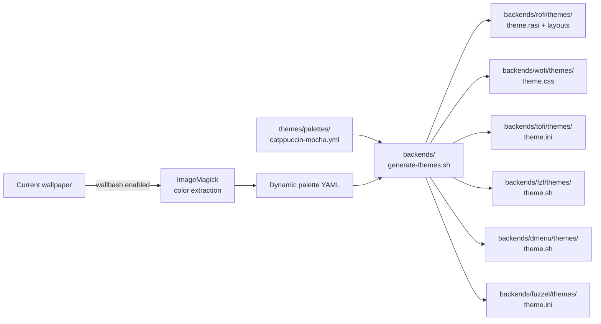

Backend adapters are the bridge between kall's module system and the actual menu launcher that renders on screen. Each backend is a self-contained directory under `backends/` that implements a standard interface. This page covers the menu adapter interface, capability reporting, the theme generation pipeline, and how to write a new backend.

## Menu Adapter Interface

Every backend must implement five functions. `lib/menu.sh` validates this at source time and calls `log_fatal` if any function is missing:

```bash
_kall_menu_required_functions=(
  menu_dmenu
  menu_launch
  menu_calc
  menu_keys
  menu_supports
)

for _kall_fn in "${_kall_menu_required_functions[@]}"; do
  if ! declare -f "$_kall_fn" &>/dev/null; then
    log_fatal "menu.sh: backend '$KALL_MENU_BACKEND' missing required function: $_kall_fn"
  fi
done
```

### Function Signatures

#### `menu_dmenu [OPTIONS]`

The primary menu function. Reads newline-separated items from stdin and returns the selected item on stdout.

| Parameter | Description |
|---|---|
| `-p PROMPT` | Prompt string displayed in the menu |
| `-l LINES` | Number of visible lines/rows |
| `-i` | Case-insensitive matching |
| `-layout NAME` | Layout template name (e.g., `clipboard`, `selector`) |

**Return values:**
- Exit code `0` with the selected option on stdout on success
- Exit code `1` on user cancel/escape
- No other exit codes are valid (invariant INV-BE-03)

**Example usage by a module:**

```bash
choice=$(printf "Shutdown\nReboot\nLock\nSuspend\nLogout" | menu_dmenu -p "Power" -layout "clipboard")
```

#### `menu_launch [OPTIONS]`

Application launcher mode. Displays installed applications and runs the selected one.

| Parameter | Description |
|---|---|
| `-modi MODES` | Comma-separated modes (e.g., `drun,run,window`) |
| `-layout NAME` | Layout template name |

Not all backends support this. Backends that do not should display a warning via `log_warn` and return `1`.

#### `menu_calc`

Calculator mode. Accepts arithmetic expressions and returns results.

Only rofi supports this natively. Other backends should return `1` and log a warning.

#### `menu_keys [OPTIONS]`

Keyboard shortcut display mode. Used by the keybindings module to show WM keybinding cheat sheets.

| Parameter | Description |
|---|---|
| `-config FILE` | Keybinding config file to display |

#### `menu_supports CAPABILITY`

Capability query function. Returns `0` (true) if the backend supports the given capability, `1` (false) otherwise. This function must return accurate information (invariant INV-BE-02).

```bash
if menu_supports "icons"; then
  # format items with icons
fi
```

## Capability Matrix

| Capability | rofi | wofi | fuzzel | tofi | dmenu | fzf |
|---|:---:|:---:|:---:|:---:|:---:|:---:|
| `icons` | Yes | Yes | Yes | No | No | Partial |
| `markup` | Yes (pango) | No | No | No | No | Partial (ANSI) |
| `blocks` | Yes | No | No | No | No | Yes (reload) |
| `calc` | Yes | No | No | No | No | No |
| `launch` | Yes | Yes | Yes | No | No | No |
| `preview` | No | No | No | No | No | Yes |

Modules use `menu_supports` to check capabilities and degrade gracefully. For example, a module that benefits from icon support will still work on dmenu, just without icons. See [capability-aware degradation](/contributors/module-system#capability-aware-degradation) for patterns.

## Backend Loading

`lib/menu.sh` loads exactly one backend adapter based on `KALL_MENU_BACKEND`:

```bash
KALL_BACKENDS_DIR="${KALL_BACKENDS_DIR:-$(cd "$KALL_LIB_DIR/.." && pwd)/backends}"

_kall_menu_adapter="$KALL_BACKENDS_DIR/$KALL_MENU_BACKEND/adapter.sh"

if [[ ! -f "$_kall_menu_adapter" ]]; then
  log_fatal "menu.sh: backend adapter not found: $_kall_menu_adapter"
fi

source "$_kall_menu_adapter"
```

The `KALL_MENU_BACKEND` value comes from `kall.yml` (default: `rofi`):

```yaml
# ~/.config/kall/kall.yml
menu_backend: rofi    # rofi | wofi | tofi | fuzzel | dmenu | fzf
```

## Theme Generation Pipeline

One canonical palette YAML drives theme generation for all backends. The `backends/generate-themes.sh` script reads a palette and produces backend-specific theme files:



### Generated Theme File Formats

| Backend | Format | File | What it contains |
|---|---|---|---|
| rofi | Rasi | `theme.rasi` + layout files | Colors, fonts, window geometry |
| wofi | CSS | `theme.css` | CSS variables for colors and sizing |
| tofi | INI | `theme.ini` | Key-value color and font settings |
| fuzzel | INI | `theme.ini` | Key-value color settings |
| dmenu | Shell | `theme.sh` | Exports `-nb`, `-nf`, `-sb`, `-sf` color args |
| fzf | Shell | `theme.sh` | Exports `FZF_DEFAULT_OPTS --color` string |

### Color Variable Mapping

The generator reads these canonical color variables from palette YAML and maps them to backend-specific formats:

| Palette key | Purpose | Example (Catppuccin Mocha) |
|---|---|---|
| `main_bg` | Primary background | `#1E1E2E` |
| `main_fg` | Primary foreground/text | `#CDD6F4` |
| `main_br` | Border/accent | `#CBA6F7` |
| `main_ex` | Extra/highlight | `#F5E0DC` |
| `select_bg` | Selected item background | `#B4BEFE` |
| `select_fg` | Selected item foreground | `#1E1E2E` |
| `urgent_bg` | Urgent/error background | `#F38BA8` |
| `urgent_fg` | Urgent/error foreground | `#1E1E2E` |

These are exported at runtime as `KALL_COLOR_*` environment variables by `lib/theme.sh`. The backend adapter reads them when applying the theme.

## Backend Directory Structure

Each backend follows this layout:

```
backends/rofi/
├── adapter.sh              # menu adapter implementation
├── themes/
│   ├── theme.rasi          # active color theme
│   ├── style_{1..12}.rasi  # 12 launcher layout styles
│   ├── clipboard.rasi      # small dropdown layout
│   ├── simple.rasi         # single-column layout
│   ├── selector.rasi       # icon grid layout
│   ├── searchbar.rasi      # fullscreen search overlay
│   ├── launchpad.rasi      # fullscreen app grid
│   └── wallpaper-slider.rasi
└── README.md
```

Layout files are backend-specific templates that control the visual arrangement of a menu. They live under `backends/<name>/themes/` and are referenced by the `layout` field in `module.yml`.

## Backend Invariants

- **INV-BE-01:** Every directory under `backends/` must contain an `adapter.sh` that implements the full menu adapter interface
- **INV-BE-02:** `menu_supports()` must return accurate capability information. A backend must not claim support for a capability it does not implement
- **INV-BE-03:** `menu_dmenu()` must return exit code `0` with the selected option on stdout on success, and exit code `1` on user cancel/escape. No other exit codes are valid
- **INV-BE-04:** Backend adapters must not access module internals. The adapter interface is the only contract between backends and modules

## How to Add a New Backend

1. **Create the backend directory:**

```
backends/mybackend/
├── adapter.sh
├── themes/
│   └── theme.<ext>
└── README.md
```

2. **Implement all five interface functions** in `adapter.sh`:

```bash
#!/usr/bin/env bash
# backends/mybackend/adapter.sh

menu_dmenu() {
  local prompt="" lines="" layout="" case_insensitive=""

  while [[ $# -gt 0 ]]; do
    case "$1" in
      -p) prompt="$2"; shift 2 ;;
      -l) lines="$2"; shift 2 ;;
      -i) case_insensitive=1; shift ;;
      -layout) layout="$2"; shift 2 ;;
      *) shift ;;
    esac
  done

  # Read items from stdin, present menu, write selection to stdout
  # Return 0 on selection, 1 on cancel
}

menu_launch() {
  # Application launcher mode
  log_warn "mybackend: menu_launch not supported"
  return 1
}

menu_calc() {
  log_warn "mybackend: menu_calc not supported"
  return 1
}

menu_keys() {
  log_warn "mybackend: menu_keys not supported"
  return 1
}

menu_supports() {
  local capability="$1"
  case "$capability" in
    icons)   return 1 ;;
    markup)  return 1 ;;
    blocks)  return 1 ;;
    calc)    return 1 ;;
    launch)  return 1 ;;
    preview) return 1 ;;
    *)       return 1 ;;
  esac
}
```

3. **Add theme generation** to `backends/generate-themes.sh` so that palettes produce valid theme files for your backend.

4. **Handle layout hints.** Your `menu_dmenu` implementation should translate [layout hints](/contributors/module-system#layout-hints) from `module.yml` into backend-specific rendering (columns, icon size, preview commands, etc.).

5. **Handle the `managed: false` appearance mode.** When `KALL_APPEARANCE_MANAGED` is `false`, skip all styling arguments and let the user's own backend configuration control appearance.

6. **Handle missing optional dependencies gracefully.** For example, if your backend supports image preview but the required tool is not installed, fall back to text-only rendering.

7. **Write tests** covering all five interface functions and capability reporting accuracy.

8. **Update documentation** to include the new backend in the capability matrix.
