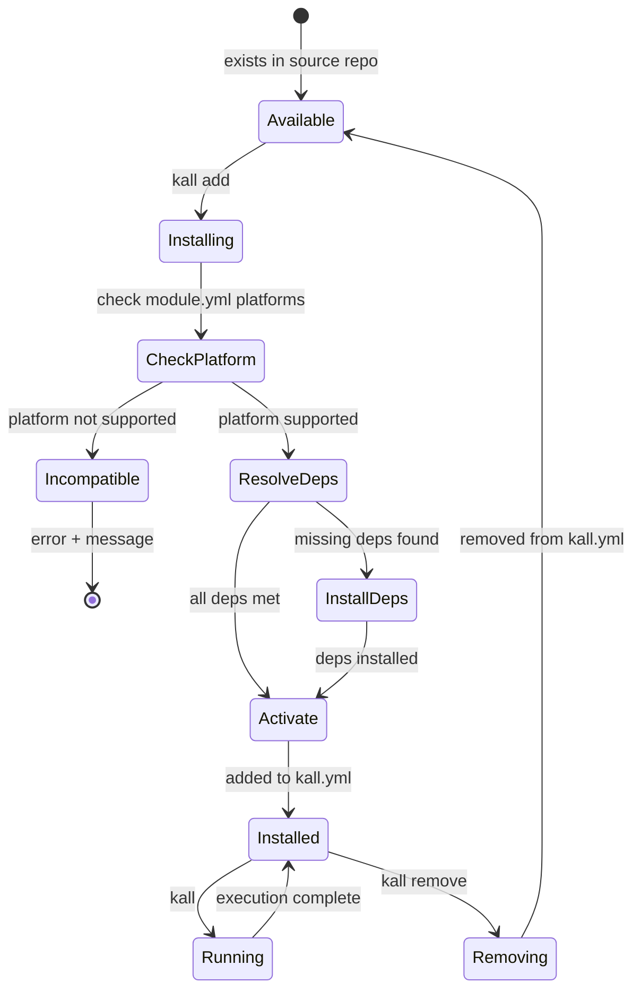
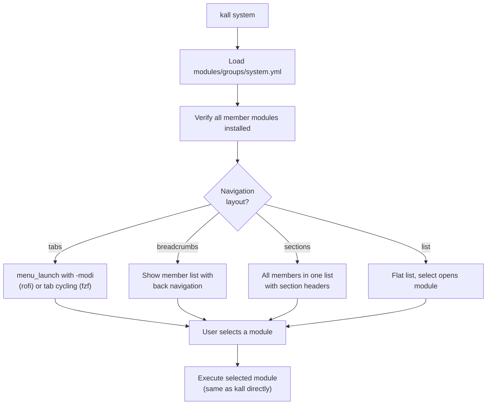

Modules are the feature units of kall. Each module is a self-contained directory that provides a specific capability (power menu, clipboard manager, screenshot tool, etc.) through the shared lib infrastructure. This page covers the module contract, lifecycle, group system, layout hints, and how modules degrade gracefully across backends.

## Module Structure

Every module is a directory under `modules/` with a standard layout:

```
modules/power/
├── module.yml       # metadata, deps, keybindings
├── power.sh         # entry point (sources lib, focused logic)
└── power.rasi       # optional module-specific theme override
```

The entry script (`power.sh`) sources lib files and calls lib functions exclusively. It never calls platform tools directly.

## Module Contract: module.yml

The `module.yml` file is the manifest that defines everything about a module. It is parsed by `yq` and validated against `schemas/module.schema.yml`.

### Full Field Reference

```yaml
name: power
description: Power menu — shutdown, reboot, lock, suspend, logout
version: "1.0"
author: shaiknoorullah
category: system

# Layout template — references a shared layout file from backends/<backend>/themes/
# Options: clipboard (small dropdown), simple (single column),
#          selector (icon grid), searchbar (fullscreen), launchpad (fullscreen grid)
layout: clipboard

platforms:
  linux:
    x11: true
    wayland: true
  macos: true

requires:
  lib:
    - core
    - platform
    - menu
    - notify
  # Tools that lib/adapters need to fulfill this module's actions.
  # Modules never call these directly — they call lib functions which
  # delegate to adapters. Listed here so the installer knows what to install.
  adapter_tools:
    common:
      - systemctl
    wm:
      x11: [i3lock, i3-msg]
      wayland: [hyprlock, hyprctl]
      darwin: [osascript]

# Normalized keybinding — kall translates to WM-specific syntax
keybinding:
  mods: [mod, shift]     # mod | shift | ctrl | alt | super
  key: e                 # single key (lowercase)

config:
  user_editable:
    - key: confirm_destructive
      description: Require confirmation for shutdown/reboot/logout
      default: true
```

### Field Details

| Field | Required | Description |
|---|---|---|
| `name` | Yes | Unique identifier, must match directory name |
| `description` | No | Human-readable one-liner |
| `version` | No | Semver string |
| `author` | No | Author name or handle |
| `category` | No | One of: `system`, `productivity`, `developer`, `browser`, `notes`, `core` |
| `layout` | No | Default layout template name |
| `platforms` | No | Platform compatibility flags |
| `requires.lib` | No | List of required kall lib modules |
| `requires.adapter_tools` | No | Platform tools needed by lib adapters |
| `keybinding` | No | Default keybinding in normalized form |
| `config.user_editable` | No | Config keys the user can override |

### Key Clarifications

- **`layout`** specifies which layout template to use for this module's menu. The layout file lives under `backends/<backend>/themes/` and is generated per backend. It is not the same as a color theme.
- **`requires.adapter_tools`** lists tools that lib adapters need, not tools the module calls directly. For example, the `power` module calls `lock_screen()` from `lib/platform.sh`, which delegates to the WM adapter, which calls `hyprlock` or `i3lock`. The module never touches these tools. They are listed so the installer knows what system packages to install.
- **`platforms.linux.x11` and `platforms.linux.wayland`** must both be true or both be false. Modules cannot support only one Linux display server (enforced by invariant INV-MOD-05).

### Schema Validation

The schema at `schemas/module.schema.yml` validates the structure:

```yaml
properties:
  name:
    type: string
    required: true
  category:
    type: string
    enum: [system, productivity, developer, browser, notes, core]
  platforms:
    type: object
    properties:
      linux:
        type: object
        properties:
          x11:
            type: boolean
          wayland:
            type: boolean
      macos:
        type: boolean
  requires:
    type: object
    properties:
      lib:
        type: array
        items:
          type: string
      adapter_tools:
        type: object
  keybinding:
    type: object
    properties:
      mods:
        type: array
        items:
          type: string
      key:
        type: string
```

## Module Lifecycle



### Management Commands

```bash
kall add emoji calculator systemd     # install modules + deps
kall remove zen-workspaces            # remove from manifest
kall list                             # installed modules
kall list --available                 # all modules for this platform
```

`kall add` reads `module.yml`, checks platform compatibility, installs missing deps via the detected package manager, adds the module to `kall.yml`, and copies user-editable config files.

## Module Groups

Groups aggregate multiple modules into a single navigable menu. A group is a YAML file in `modules/groups/`:

```yaml
# modules/groups/system.yml

name: system
type: group
description: System controls — power, display, bluetooth, services
layout: tabs

members:
  - module: power
    icon: "⏻"
    label: Power
  - module: display
    icon: "󰍹"
    label: Display
  - module: bluetooth
    icon: "󰂯"
    label: Bluetooth
  - module: systemd
    icon: "󰒓"
    label: Services

keybinding:
  mods: [mod, shift]
  key: s
```

### Navigation Modes

Groups declare a navigation layout that the backend adapter translates into its own rendering:

| Layout | rofi | wofi/fuzzel | fzf |
|---|---|---|---|
| `tabs` | Native `-modi` tab bar | Dropdown selector at top | `--bind` ctrl-tab cycle + header |
| `breadcrumbs` | `-mesg` header: `kall > system > power` | Header text | `--header` with back option |
| `sections` | Pango markup section headers | Separator lines | ANSI colored headers |
| `list` | Flat list, select opens module | Same | Same |

### Group Navigation Flow



### Usage

```bash
kall system                      # opens the group
kall system power                # jumps to power within group
kall power                       # still works standalone
```

Users can create custom groups in `kall.yml`:

```yaml
custom_groups:
  - name: favorites
    layout: list
    members: [power, clipboard, screenshot, websearch]
```

Shipped groups: `system`, `productivity`, `developer`, `browser`, `notes`.

## Layout Hints

Each module defines backend-agnostic layout preferences in `module.yml`. The backend adapter translates them into backend-specific rendering. Users can override any module's layout in `kall.yml`.

```yaml
layout: selector
layout_hints:
  columns: 4
  icon_size: large           # small | medium | large
  show_icons: true
  show_preview: true
  orientation: vertical      # horizontal | vertical
  width: "80%"
  lines: 8

  # Backend-specific preview pipelines
  preview:
    fzf:
      command: "chafa --size=40x20 {}"
      position: right
      size: "50%"
    rofi:
      icon_source: thumbnail
```

### fzf Preview Pipeline

fzf's `--preview` flag supports piping to any tool, enabling rich previews:

| Module | Preview command | Result |
|---|---|---|
| wallpaper | `chafa --size=40x20 {}` | Inline wallpaper thumbnail |
| projects | `eza --tree --level=2 --icons --color=always {}` | Color file tree |
| bookmarks | `curl -sL {url} \| bat --language=html` | Syntax-highlighted HTML |
| clipboard | `bat --color=always --plain` | Full entry with syntax detect |
| obsidian-search | `bat --language=markdown --color=always {}` | Rendered markdown |

Preview degrades to plain text if a tool is missing.

### User Overrides

Users override layout hints per module in `kall.yml`:

```yaml
module_overrides:
  wallpaper:
    layout_hints:
      columns: 6
      icon_size: medium
  projects:
    layout_hints:
      preview:
        fzf:
          command: "eza --tree --level=3 --icons --git-ignore --color=always {}"
          size: "70%"
```

## Capability-Aware Degradation

Modules query the menu backend for capabilities and degrade gracefully when a feature is not supported:

```bash
if menu_supports "blocks"; then
  # live autocomplete via rofi-blocks
  launch_with_blocks
else
  # simple text input
  query=$(echo "" | menu_dmenu -p "Search")
  open_search "$query"
fi

if menu_supports "markup"; then
  label='<b><span color="#CBA6F7">Power</span></b>'
else
  label="Power"
fi
```

The `menu_supports` function is provided by the loaded backend adapter. See the [backend adapters](/contributors/backend-adapters) page for the full capability matrix.

A module must function correctly when any supported menu backend is active. Module behavior may degrade (fewer features) but must never crash or produce errors (invariant INV-MOD-06).

## Module Invariants

CI enforces these on every PR:

- **INV-MOD-01:** Every directory under `modules/` (excluding `groups/`) must contain a `module.yml` and an entry script named `<module-name>.sh`
- **INV-MOD-02:** Every module must have a corresponding `test_<module-name>.bats` file in `tests/`
- **INV-MOD-03:** No module script may contain a direct invocation of any platform-specific tool. CI validates this by grepping for a forbidden tool list
- **INV-MOD-04:** Every `module.yml` must validate against `schemas/module.schema.yml`
- **INV-MOD-05:** Modules must not support only one Linux display server (both `x11` and `wayland` must match)
- **INV-MOD-06:** A module must function correctly when any supported menu backend is active
