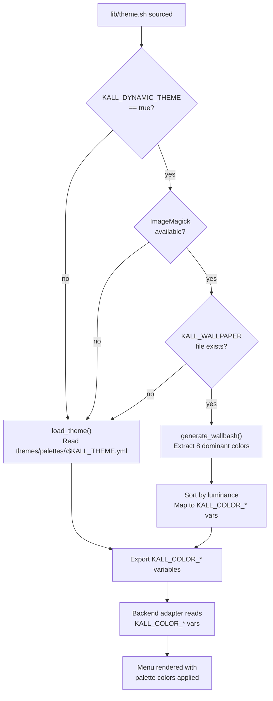

The theme engine (`lib/theme.sh`) manages color palettes across the entire kall system. It loads colors from YAML palette files, exports standardized `KALL_COLOR_*` environment variables, and optionally extracts colors from the current wallpaper using ImageMagick. This page covers the palette format, both loading modes, the cross-backend theme generation pipeline, and how to add a custom palette.

## Palette YAML Format

Every palette lives in `themes/palettes/` as a YAML file. The format defines eight canonical color slots that map to semantic roles in the UI. Here is the structure using `catppuccin-mocha.yml` as a reference:

```yaml
# themes/palettes/catppuccin-mocha.yml
name: Catppuccin Mocha
author: catppuccin
variant: dark

colors:
  main_bg: "#1e1e2e"     # Primary background
  main_fg: "#cdd6f4"     # Primary foreground / text
  main_br: "#89b4fa"     # Border / accent color
  main_ex: "#f5c2e7"     # Extra accent (highlights, badges)
  select_bg: "#313244"   # Selected item background
  select_fg: "#cdd6f4"   # Selected item foreground
  urgent_bg: "#f38ba8"   # Urgent / error background
  urgent_fg: "#1e1e2e"   # Urgent / error foreground
```

All eight color keys are required. A palette that omits any key is invalid and will fail schema validation against `schemas/palette.schema.yml`. The invariant INV-THM-01 enforces this: no partial palettes are allowed.

The shipped palettes are:

| Palette | File |
|---|---|
| Catppuccin Mocha | `catppuccin-mocha.yml` |
| Dracula | `dracula.yml` |
| Nord | `nord.yml` |
| Gruvbox | `gruvbox.yml` |
| Tokyo Night | `tokyo-night.yml` |
| Rose Pine | `rose-pine.yml` |

## Static Palette Loading

Static loading is the default mode. When `lib/theme.sh` is sourced, it calls `load_theme` to read the active palette and export color variables.

### `load_theme` Function

```bash
load_theme() {
  local palette_name="${1:-${KALL_THEME:-catppuccin-mocha}}"
  local palette_file="$KALL_PALETTES_DIR/${palette_name}.yml"

  # Fallback to catppuccin-mocha if palette not found
  if [[ ! -f "$palette_file" ]]; then
    log_warn "theme.sh: palette '$palette_name' not found, falling back to catppuccin-mocha"
    palette_name="catppuccin-mocha"
    palette_file="$KALL_PALETTES_DIR/${palette_name}.yml"
  fi

  if [[ ! -f "$palette_file" ]]; then
    log_error "theme.sh: fallback palette catppuccin-mocha not found at $palette_file"
    return 1
  fi

  if ! command -v yq &>/dev/null; then
    log_error "theme.sh: yq not found, cannot load palette"
    return 1
  fi

  # Read each color via yq and export
  KALL_COLOR_MAIN_BG="$(yq '.colors.main_bg' "$palette_file" 2>/dev/null)"
  KALL_COLOR_MAIN_FG="$(yq '.colors.main_fg' "$palette_file" 2>/dev/null)"
  KALL_COLOR_MAIN_BR="$(yq '.colors.main_br' "$palette_file" 2>/dev/null)"
  KALL_COLOR_MAIN_EX="$(yq '.colors.main_ex' "$palette_file" 2>/dev/null)"
  KALL_COLOR_SELECT_BG="$(yq '.colors.select_bg' "$palette_file" 2>/dev/null)"
  KALL_COLOR_SELECT_FG="$(yq '.colors.select_fg' "$palette_file" 2>/dev/null)"
  KALL_COLOR_URGENT_BG="$(yq '.colors.urgent_bg' "$palette_file" 2>/dev/null)"
  KALL_COLOR_URGENT_FG="$(yq '.colors.urgent_fg' "$palette_file" 2>/dev/null)"

  export KALL_COLOR_MAIN_BG KALL_COLOR_MAIN_FG KALL_COLOR_MAIN_BR KALL_COLOR_MAIN_EX
  export KALL_COLOR_SELECT_BG KALL_COLOR_SELECT_FG
  export KALL_COLOR_URGENT_BG KALL_COLOR_URGENT_FG
}
```

The resolution order is:

1. Explicit argument passed to `load_theme` (e.g., `load_theme dracula`)
2. The `KALL_THEME` environment variable (set by `core.sh` from `kall.yml`)
3. Hardcoded fallback: `catppuccin-mocha`

If the requested palette file does not exist, the function logs a warning and falls back to `catppuccin-mocha`. If even the fallback is missing, it returns exit code 1 and logs an error. The `yq` binary is required for palette parsing; if absent, loading fails with an error.

### Auto-Load Behavior

When `lib/theme.sh` is sourced, it automatically loads a theme at the bottom of the file:

```bash
if [[ "${KALL_DYNAMIC_THEME:-false}" == "true" ]]; then
  # Try wallbash first, fall back to static palette
  if ! generate_wallbash "${KALL_WALLPAPER:-}"; then
    load_theme
  fi
else
  load_theme
fi
```

This means every module gets color variables populated before it runs. No module needs to call `load_theme` manually.

## Dynamic Wallbash

Wallbash is the opt-in dynamic theming mode. Instead of reading from a curated palette file, it extracts dominant colors from the user's current wallpaper using ImageMagick and maps them to `KALL_COLOR_*` variables.

### Enabling Wallbash

Users enable wallbash via:

```bash
kall theme wallbash on
```

This sets `dynamic_theme: true` in `kall.yml`, which causes `KALL_DYNAMIC_THEME=true` to be set when `core.sh` loads config. The theme engine then tries `generate_wallbash` before falling back to `load_theme`.

### `generate_wallbash` Function

The function takes a wallpaper file path and performs color extraction:

```bash
generate_wallbash() {
  local wallpaper="$1"

  # Validate wallpaper exists
  if [[ ! -f "$wallpaper" ]]; then
    log_warn "theme.sh: wallpaper not found: $wallpaper"
    return 1
  fi

  # Require ImageMagick
  if ! command -v convert &>/dev/null; then
    log_warn "theme.sh: ImageMagick (convert) not found, cannot generate wallbash"
    return 1
  fi

  # Extract 8 dominant colors using color quantization
  local colors
  colors="$(convert "$wallpaper" -resize 100x100! -colors 8 -unique-colors txt:- 2>/dev/null \
    | grep -oE '#[0-9A-Fa-f]{6}' | head -8)"
  ...
}
```

The extraction pipeline works as follows:

1. **Resize** the wallpaper to 100x100 pixels (forced aspect ratio) to speed up processing.
2. **Quantize** to 8 colors using ImageMagick's built-in color reduction algorithm.
3. **Extract unique colors** into text format and parse hex values.
4. **Sort by luminance** to assign colors to semantic roles (darkest colors become backgrounds, lightest become foregrounds).

### Luminance Sorting

After extraction, colors are sorted by relative luminance using the formula `R * 299 + G * 587 + B * 114` (the BT.601 luma coefficients). This produces a consistent mapping:

| Sort position | Maps to | Semantic role |
|---|---|---|
| 1 (darkest) | `KALL_COLOR_MAIN_BG` | Primary background |
| 2 | `KALL_COLOR_SELECT_BG` | Selected item background |
| 4 | `KALL_COLOR_URGENT_BG` | Urgent background |
| 5 | `KALL_COLOR_MAIN_EX` | Extra accent |
| 6 | `KALL_COLOR_MAIN_BR` | Border accent |
| 7 | `KALL_COLOR_SELECT_FG` | Selected item foreground |
| 8 (lightest) | `KALL_COLOR_MAIN_FG`, `KALL_COLOR_URGENT_FG` | Primary and urgent foreground |

### Fallback Behavior

The wallbash function returns exit code 1 in three cases:

- The wallpaper file does not exist
- ImageMagick (`convert`) is not installed
- Color extraction produced fewer than 8 colors

In all cases, the auto-load block catches the failure and falls back to `load_theme`, loading the static palette. This satisfies invariant INV-THM-03: dynamic theme generation always falls back gracefully.

## Theme Generation Across Backends

Palette files are backend-agnostic YAML. Each menu backend needs colors in its own format (rofi uses `.rasi`, wofi uses `.css`, fzf uses shell environment variables). The `backends/generate-themes.sh` script bridges this gap.

### Pipeline

```
themes/palettes/*.yml
        |
        v
backends/generate-themes.sh
        |
        +---> backends/rofi/themes/*.rasi
        +---> backends/wofi/themes/*.css
        +---> backends/tofi/themes/*.ini
        +---> backends/fuzzel/themes/*.ini
        +---> backends/dmenu/themes/*.sh
        +---> backends/fzf/themes/*.sh
```

The script iterates over every palette in `themes/palettes/`, reads the eight canonical color values, and writes a theme file in each backend's native format. This design means adding a new palette requires zero changes to any backend — you drop a `.yml` file in `themes/palettes/` and run `generate-themes.sh`.

### Backend Theme Formats

Each backend receives colors in its native syntax:

**Rofi** (`.rasi`):
```css
* {
    kall-main-bg: #1e1e2e;
    kall-main-fg: #cdd6f4;
    kall-main-br: #89b4fa;
    kall-main-ex: #f5c2e7;
    kall-select-bg: #313244;
    kall-select-fg: #cdd6f4;
    kall-urgent-bg: #f38ba8;
    kall-urgent-fg: #1e1e2e;
}
```

**Wofi** (`.css`):
```css
@define-color kall-main-bg #1e1e2e;
@define-color kall-main-fg #cdd6f4;
/* ... */
```

**fzf** (`.sh`):
```bash
export FZF_DEFAULT_OPTS="$FZF_DEFAULT_OPTS \
  --color=bg+:#313244,bg:#1e1e2e,fg:#cdd6f4,fg+:#cdd6f4 \
  --color=hl:#f5c2e7,hl+:#f5c2e7,info:#89b4fa,marker:#f5c2e7 \
  --color=prompt:#89b4fa,spinner:#f5c2e7,pointer:#f5c2e7,header:#f38ba8"
```

**dmenu** (`.sh`):
```bash
DMENU_COLORS="-nb '#1e1e2e' -nf '#cdd6f4' -sb '#313244' -sf '#cdd6f4'"
```

**tofi / fuzzel** (`.ini`):
```ini
[colors]
background = #1e1e2e
foreground = #cdd6f4
selection-background = #313244
selection-foreground = #cdd6f4
border = #89b4fa
```

Invariant INV-THM-02 requires that `generate-themes.sh` produces valid output for every backend from any valid palette. A new palette file must never require changes to any backend's theme generation logic.

## Color Variable Reference

After theme loading (static or wallbash), these environment variables are exported and available to all lib functions and backend adapters:

| Variable | Palette key | Semantic role |
|---|---|---|
| `KALL_COLOR_MAIN_BG` | `colors.main_bg` | Primary background |
| `KALL_COLOR_MAIN_FG` | `colors.main_fg` | Primary foreground / text |
| `KALL_COLOR_MAIN_BR` | `colors.main_br` | Border and accent color |
| `KALL_COLOR_MAIN_EX` | `colors.main_ex` | Extra accent (highlights, badges) |
| `KALL_COLOR_SELECT_BG` | `colors.select_bg` | Selected item background |
| `KALL_COLOR_SELECT_FG` | `colors.select_fg` | Selected item foreground |
| `KALL_COLOR_URGENT_BG` | `colors.urgent_bg` | Urgent / error background |
| `KALL_COLOR_URGENT_FG` | `colors.urgent_fg` | Urgent / error foreground |

Backend adapters read these variables when constructing theme arguments. Modules never read color variables directly — they declare layout hints and the backend handles all visual rendering.

## Listing Available Palettes

The `list_palettes` function scans `themes/palettes/` and returns bare palette names (without path or extension):

```bash
list_palettes() {
  local f
  for f in "$KALL_PALETTES_DIR"/*.yml; do
    [[ -f "$f" ]] || continue
    basename "$f" .yml
  done
}
```

The CLI exposes this via `kall theme list`.

## Adding a Custom Palette

To add a new palette to kall:

### Step 1: Create the Palette File

Create a YAML file in `themes/palettes/` with your palette name:

```bash
touch themes/palettes/my-custom-theme.yml
```

### Step 2: Define All Eight Colors

Populate the file with the required structure. Every key under `colors` is mandatory:

```yaml
name: My Custom Theme
author: your-name
variant: dark  # or "light"

colors:
  main_bg: "#1a1b26"
  main_fg: "#c0caf5"
  main_br: "#7aa2f7"
  main_ex: "#bb9af7"
  select_bg: "#283457"
  select_fg: "#c0caf5"
  urgent_bg: "#f7768e"
  urgent_fg: "#1a1b26"
```

### Step 3: Validate Against the Schema

Run schema validation to ensure all required keys are present:

```bash
kall doctor
```

The doctor command validates palette files against `schemas/palette.schema.yml`.

### Step 4: Generate Backend Themes

Run the theme generation script to produce backend-specific theme files:

```bash
./backends/generate-themes.sh
```

This reads your new palette and creates theme files in every backend's `themes/` directory.

### Step 5: Test the Palette

Activate your palette and verify it renders correctly:

```bash
kall theme set my-custom-theme
kall power  # or any module — check that colors apply
```

### Step 6: Commit

Follow the commit convention:

```bash
git add themes/palettes/my-custom-theme.yml
git commit -m "feat(theme/my-custom-theme): add custom dark palette"
```

## Theme Flow Diagram

The full flow from user config to rendered menu:



## Relevant Invariants

- **INV-THM-01:** Every palette in `themes/palettes/` must define the complete set of required color variables. No partial palettes.
- **INV-THM-02:** `backends/generate-themes.sh` must produce valid theme files for every backend from any valid palette. A new palette must not require changes to any backend.
- **INV-THM-03:** Dynamic wallbash theme generation must fall back to the active static palette if ImageMagick is not installed or wallpaper extraction fails.
